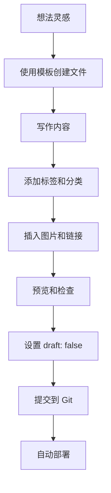

# Obsidian 集成指南

## 概述

本指南详细介绍如何将 Obsidian 与 Hugo 博客系统集成，实现高效的本地编辑和自动部署工作流。

## Obsidian 配置

### 1. 设置工作区

1. **打开 Obsidian**
2. **选择"打开文件夹作为仓库"**
3. **选择博客项目的 `content/` 目录**

### 2. 配置附件设置

进入 Obsidian **设置 → 文件与链接**：

#### 默认附件存储位置
- 选择 **"当前文件夹下指定子文件夹"**
- **新附件的默认位置**: `images`

#### 内部链接设置
- **新链接的格式**: `基于文件夹的相对路径`
- **链接格式**: `Markdown 链接`

### 3. 配置编辑器设置

#### 编辑器行为
- **实时预览**: 启用
- **严格换行**: 启用
- **使用制表符**: 禁用
- **显示空格**: 可选

#### 外观设置
- **基础字体**: "Inter" 或系统默认字体
- **等宽字体**: "JetBrains Mono" 或 "Fira Code"
- **界面主题**: 选择与博客主题一致的颜色方案

## 文章模板设置

### 1. 创建模板目录

在 Obsidian 中创建 `Templates/` 目录：

```markdown
# Templates/
├── 博客文章.md
├── 快速笔记.md
└── 项目日志.md
```

### 2. 博客文章模板

在 `Templates/博客文章.md` 中：

```markdown
---
title: "<% tp.file.title %>"
date: <% tp.date.now("YYYY-MM-DDTHH:mm:ssZ") %>
draft: false
tags: ["技术博客"]
categories: ["技术"]
author: "作者名"
description: ""
keywords: ["Hugo", "博客"]
summary: ""
---

# <% tp.file.title %>

## 文章摘要

<!--more-->

## 正文内容

### 主要观点

### 实践步骤

### 总结

---
## 标签

#技术博客 #Hugo
```

### 3. 快速笔记模板

在 `Templates/快速笔记.md` 中：

```markdown
---
title: "<% tp.file.title %>"
date: <% tp.date.now("YYYY-MM-DDTHH:mm:ssZ") %>
draft: true
tags: ["笔记"]
categories: ["临时笔记"]
---

# <% tp.file.title %>

## 想法

## 要点

1.
2.
3.

## 参考资料
```

## 推荐插件

### 1. Templater

**功能**: 强大的模板系统
**安装**: 通过 Obsidian 社区插件安装

**配置**:
```javascript
// Templater 设置
Template folder location: Templates/
Enable system command executions: false
Enable active user functions: false
```

**常用命令**:
```javascript
<% tp.date.now("YYYY-MM-DD") %>  // 当前日期
<% tp.file.title %>               // 文件名
<% tp.file.folder() %>             // 文件夹路径
```

### 2. Image auto upload

**功能**: 图片自动上传到图床
**配置**:
- **图床服务**: Imgur, GitHub, 或自建
- **上传后删除本地图片**: 可选

### 3. Tag Wrangler

**功能**: 标签管理
**用途**:
- 重命名标签
- 合并相似标签
- 标签统计分析

### 4. Linter

**功能**: Markdown 格式化
**配置**:
```yaml
# 启用的规则
- emphasis-style
- format-yaml
- header-increment
- remove-multiple-spaces
- yaml-title-alias
```

## 工作流程

### 1. 新文章创作流程



### 2. 日常维护流程

#### 每日检查清单
- [ ] 检查未发布的草稿
- [ ] 回复读者评论
- [ ] 更新过时的内容
- [ ] 备份重要文章

#### 每周维护
- [ ] 分析访问统计
- [ ] 规划下周内容
- [ ] 优化标签分类
- [ ] 检查链接有效性

### 3. 发布前检查

#### 内容检查
- [ ] 标题吸引人且准确
- [ ] 摘要概括主要内容
- [ ] 正文结构清晰
- [ ] 图片替代文本完整
- [ ] 链接都能正常访问

#### 技术检查
- [ ] YAML 格式正确
- [ ] Markdown 语法无误
- [ ] 代码块语法高亮正确
- [ ] 图片路径正确
- [ ] Front Matter 完整

## 图片管理

### 1. 目录结构

建议的图片组织结构：

```
content/
├── posts/
│   ├── 2025/
│   │   ├── article1.md
│   │   ├── article1/
│   │   │   ├── image1.png
│   │   │   └── image2.jpg
│   │   └── article2.md
│   └── 2024/
└── images/
    ├── common/
    │   ├── logo.png
    │   └── banner.jpg
    └── avatars/
        └── profile.jpg
```

### 2. 图片插入方法

#### 相对路径插入
```markdown

```

#### 绝对路径插入
```markdown

```

### 3. 图片优化建议

- **格式**: 优先使用 WebP 格式
- **大小**: 单张图片不超过 500KB
- **尺寸**: 宽度不超过 1200px
- **命名**: 使用有意义的文件名

## 高级技巧

### 1. 批量操作

#### 使用 Git 批量提交
```bash
# 提交所有新文章
git add content/posts/
git commit -m "feat: 添加多篇新文章"

# 推送到远程仓库
git push origin main
```

#### 使用脚本批量处理
```python
# 示例：批量更新文章日期
import os
import yaml
from datetime import datetime

def update_post_dates(directory):
    for filename in os.listdir(directory):
        if filename.endswith('.md'):
            filepath = os.path.join(directory, filename)
            with open(filepath, 'r', encoding='utf-8') as f:
                content = f.read()

            # 解析并更新 front matter
            # ... 实现逻辑
```

### 2. 自动化工作流

#### 使用 GitHub Actions
创建 `.github/workflows/auto-deploy.yml`:

```yaml
name: Auto Deploy on Push

on:
  push:
    paths:
      - 'content/posts/**'

jobs:
  build-and-deploy:
    runs-on: ubuntu-latest
    steps:
      - uses: actions/checkout@v4
      - name: Setup Hugo
        uses: peaceiris/actions-hugo@v3
      - name: Build
        run: hugo --minify
      - name: Deploy
        uses: peaceiris/actions-gh-pages@v3
        with:
          github_token: ${{ secrets.GITHUB_TOKEN }}
          publish_dir: ./public
```

### 3. 内容复用

#### 创建内容片段
在 `content/partials/` 中创建可重用的内容：

```markdown
<!-- content/partials/contact-info.md -->
## 联系方式

- **GitHub**: [username](https://github.com/username)
- **Email**: your.email@example.com
- **Twitter**: [@username](https://twitter.com/username)
```

#### 在文章中引用
```markdown

```

## 故障排除

### 常见问题

#### 1. 图片不显示
**问题**: 本地正常但部署后图片不显示
**解决方案**:
- 检查图片路径是否正确
- 确认图片文件已提交到 Git
- 检查文件名大小写

#### 2. YAML 解析错误
**问题**: Hugo 构建时报 YAML 错误
**解决方案**:
- 检查缩进是否正确（使用空格，不要用 Tab）
- 确认特殊字符已正确转义
- 使用 YAML 验证工具检查语法

#### 3. 链接失效
**问题**: 发布后内部链接失效
**解决方案**:
- 使用相对路径链接
- 检查文件名和路径
- 使用 Hugo 的 `relref` 短代码

### 调试技巧

#### 1. 本地构建测试
```bash
# 构建并检查错误
hugo --buildDrafts=false

# 检查输出目录
ls -la public/
```

#### 2. 使用浏览器开发者工具
- 检查控制台错误信息
- 查看网络请求状态
- 验证资源加载情况

## 最佳实践

### 1. 内容规划
- **内容日历**: 制定每月发布计划
- **主题系列**: 创建相关的文章系列
- **质量控制**: 建立内容审核流程

### 2. SEO 优化
- **关键词研究**: 了解目标读者搜索习惯
- **元数据完善**: 填写完整的 front matter
- **内部链接**: 建立文章间的关联

### 3. 社区建设
- **评论互动**: 积极回复读者反馈
- **社交媒体**: 分享文章到相关平台
- **合作写作**: 与其他博主交流合作

---

**文档版本**: v1.0
**创建日期**: 2025-10-21
**最后更新**: 2025-10-21
**维护者**: 开发团队